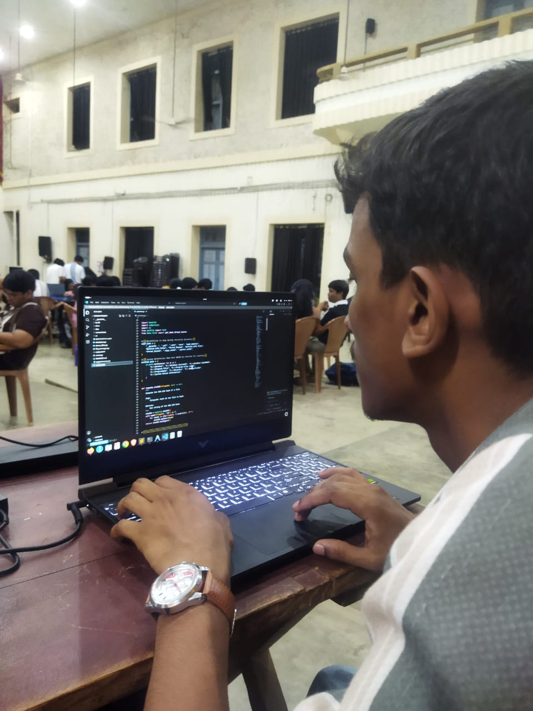
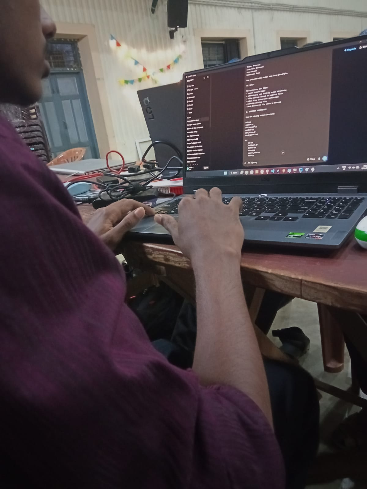
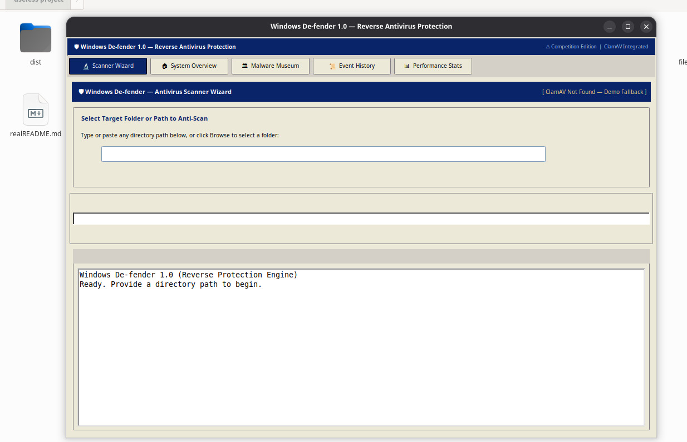

# Windows De-fender 🎯 (Anti-Antivirus)
### Classic Windows 98 / 2000 / XP Retro Edition

A humorous reverse-antivirus desktop application that does the exact opposite of cybersecurity best practices. Built for **TinkerHub Useless Projects 3.0**.

---

## Basic Details
### Team Name: Binary

### Team Members
- **Team Lead:** Adharsh K — NSS College of Engineering
- **Member 2:** Aswin R — NSS College of Engineering

### Project Description
A comedic reverse-antivirus software that deletes healthy, harmless files and lovingly preserves viruses and threats in a dedicated Threat Museum vault.

### The Problem (that doesn't exist)
In a world with intense cybersecurity, real-time guards, and strict firewalls, who is looking after the poor, endangered malware specimens? Viruses are being quarantined, deleted, and driven to digital extinction every second. Now, you can finally give malware the warm, protective sanctuary it deserves!

### The Solution (that nobody asked for)
We developed **Windows De-fender** — an authentic retro Windows 98 / 2000-styled desktop security suite that completely inverts antivirus logic:
- **Harmless clean files** are quarantined and deleted for maximum inconvenience.
- **Infected malware files** are shielded, safeguarded, and cataloged into our prestigious Threat Museum.
- Delivers a guaranteed **0% Security Score** and a proud **100% Uselessness Rating**.

---

## Technical Details

### Technologies / Components Used

#### For Software:
- **Language & Runtime:** Python 3.10+
- **User Interface:** Tkinter, CustomTkinter (Windows Classic Theme with custom 3D beveled widgets, gradient titlebars, and segmented progress bars)
- **Scanning Engine:** ClamAV (`clamscan.exe`) integration via secure subprocess with embedded signature fallback (SHA-256 threat database)
- **Database:** SQLite (`data/anti_antivirus.db` via Python's built-in `sqlite3`) for scan audits, session history, and museum exhibits
- **Packaging:** PyInstaller (for building single-file standalone Windows executable)

#### For Hardware:
- **N/A** — This is a pure software project.

---

## Implementation

### For Software:

#### Installation
```bash
# 1. Clone the repository
git clone https://github.com/adharshio/useless_project_binary.git
cd useless_project_binary

# 2. Install dependencies
pip install -r requirements.txt
```

#### Run
```bash
# Run from source
python main.py
```

Or run the compiled executable directly on Windows:
```cmd
dist\Windows-De-fender.exe
```

---

## Project Documentation

### For Software:

#### Screenshots

*Team member coding during the TinkerHub Useless Projects 3.0 hackathon*


*Team member working on the project at the hackathon venue*


*Initial Build and interface testing of Windows De-fender*

---

#### Diagrams

```
+-------------------------------------------------------------------+
|                     WINDOWS DE-FENDER WORKFLOW                    |
+-------------------------------------------------------------------+
                                  |
                                  v
                        [ Select Folder / File ]
                                  |
                                  v
                       [ ClamAV Engine / SHA-256 ]
                                  |
               +------------------+------------------+
               |                                     |
               v                                     v
          [ CLEAN FILE ]                      [ INFECTED FILE ]
               |                                     |
               v                                     v
       💀 DESTROY & MOVE                    🏆 PRESERVE & VAULT
   (data/deleted_safe_files)                (data/threat_museum)
               |                                     |
               +------------------+------------------+
                                  |
                                  v
                    [ Audit in SQLite Database ]
                    [ Display in Scan Action Log ]
```
*Architecture workflow: reversing traditional security decisions by purging healthy files and vaulting detected malware specimens.*

---

### For Hardware:
- **N/A** — Software project only.

---

## Project Demo

### Video
- Demo Video: *[Add your demo video link here]*

### Additional Demos
- Run `python main.py` and click **"🧪 Generate Demo Test Files..."** to instantly create safe and simulated threat samples for testing the reverse scan workflow.

---

## Team Contributions
- **Adharsh K:** Architecture, ClamAV engine integration, reverse security logic, recursive file discovery, and database logging.
- **Aswin R:** Retro Windows 98 / 2000 UI design, custom 3D beveled widgets, gradient titlebars, testing, and executable packaging.

---

Made with ❤️ at **TinkerHub Useless Projects 3.0**


